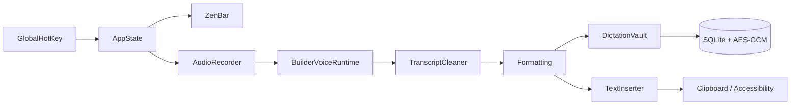

<p align="center">
  
</p>

<p align="center">
  
</p>

<p align="center">
  <a href="https://git.io/typing-svg">
    
  </a>
</p>

<p align="center">
  
  
  
  
  
</p>

<p align="center">
  
</p>

<p align="center">
  
</p>

**BuilderHelm Voice** (formerly ZenVoice) is a native macOS menu-bar app in the BuilderHelm suite. Press a shortcut, speak, press it again. The transcript is typed into whichever app has focus.

Local engines record, decode, clean, and paste on this Mac. There is no account, no subscription, and no analytics. Cloud speech is off until you tap Use on OpenAI Transcribe, Gemini Transcribe, Scribe v2, or Grok Transcribe — then that clip is uploaded and billed to your key. Optional BYO-key Cloud formatting still sends finished text only, never audio.

Private GitHub beta, 0.4.5. Apache-2.0.

---

## Features

- **Global shortcut** — `⌃⌥Space` by default. Hold-to-dictate and paste-last (`⌃⌥V`) are configurable.
- **ZenBar** — a 108×36 capsule on the display you are working on. Controls appear on hover. A live audio meter runs while you dictate. An error is the one state that stays open.
- **On-device engines** — Whisper and Parakeet TDT v3. The default path sends nothing to a speech API.
- **Cloud speech (opt-in)** — OpenAI Transcribe, Gemini Transcribe, ElevenLabs Scribe v2, and Grok Transcribe. Bring-your-own key. Audio leaves this Mac only after you tap Use on that engine. If the API fails, the same clip is decoded locally.
- **Formatting** — Off, deterministic Clean, guarded on-device Smart (macOS 26+), or opt-in BYO-key Cloud. Cloud formatting never sends audio.
- **Encrypted history** — AES-GCM transcripts, search, copy, retry, delete, Recovery Inbox.
- **Insights** — WPM gauge, total words, fixes, app usage, and a GitHub-style contribution calendar. All derived locally. Share cards carry numbers only.
- **Voice commands** — on-device phrase matching. Off until you turn them on.
- **Voice profile** — recurring phrases and explicit correction rules, encrypted. Not a biometric voiceprint.
- **Audio Doctor** — three-second local mic check. Pin a microphone or follow System Default.
- **Menu bar + main menu** — status item stays after you close the window. **⌘W** closes; **⌘Q** quits.

---

## Supported models

Choose an engine. Use downloads its file.

| Engine | Best for | Languages | Download | Hardware |
|---|---|---|---|---|
| **Parakeet TDT v3** | Default English / European insert | [25 languages](#parakeet-tdt-v3) | ~897 MB | Apple Silicon |
| **Whisper Large V3 Turbo** | Auto-detect / 99-language fallback | [99 languages](#whisper) | ~547 MB | Apple Silicon |
| **Whisper Large V3** | Higher-accuracy multilingual Whisper | 99 languages | ~1.0 GB | Apple Silicon |
| **Distil-Whisper Large V3** | Faster English | English | ~1.4 GB | Apple Silicon + Intel |

Measured on the frozen Common Voice Spontaneous set (2026-08-18): **Parakeet TDT v3 is 6.9% WER at 73× real time**; Whisper Turbo is 8.2% at 11×. Full table: [REAL_SPEECH_CORPUS.md](docs/REAL_SPEECH_CORPUS.md).

### Parakeet TDT v3

Bulgarian, Croatian, Czech, Danish, Dutch, English, Estonian, Finnish, French, German, Greek, Hungarian, Italian, Latvian, Lithuanian, Maltese, Polish, Portuguese, Romanian, Russian, Slovak, Slovenian, Spanish, Swedish, Ukrainian.

### Whisper

Turbo and Large V3 cover up to 99 languages. Distil-Whisper Large V3 is English-only. Tiny, Base, Small, Medium, and Hinglish Apex are retired.

### What gets recommended

| Condition | Final engine |
|---|---|
| English or European locale on Apple Silicon (12 GB+) | Parakeet TDT v3 |
| Apple Silicon under 12 GB | Distil-Whisper Large V3 |
| Auto-detect / non-European | Whisper Large V3 Turbo |
| Hinglish | Whisper Large V3 Turbo (Apex retired) |
| No TDT v3 installed | Whisper Large V3 Turbo |
| Intel English | Distil-Whisper Large V3 |

Pinned hashes and URLs: [Model catalogue](docs/MODEL_CATALOG.md).

NVIDIA engines run on open `parakeet.cpp`. Do not re-add FluidAudio or Fluid Intelligence.

---

## Quick start

1. **Build** from this private repository (see below) or install a signed build when one is issued. Drag `BuilderVoice.app` to `/Applications` — the display name is **BuilderHelm Voice**.
2. **Allow Microphone and Accessibility.** Without Accessibility, text still lands on the clipboard.
3. **Finish setup** — language, then the recommended engine/model, then a test dictation.
4. **Put the caret** in any editable field. Press `⌃⌥Space`, speak, press it again.
5. **(Optional)** Hold-to-dictate lives in Shortcuts. Cloud speech lives in Models. Cloud formatting lives in Personalisation. They stay off until you turn them on.

---

## Requirements

- Apple Silicon Mac for NVIDIA engines and the recommended path
- Intel Macs: Distil-Whisper Large V3 (English) or Whisper Large V3 Turbo
- Build target is macOS 14+. Certified on recent macOS; 14–26 are uncertified
- Disk: one engine file, typically 547 MB–1.4 GB
- Microphone access
- Accessibility permission to type into other apps

---

## How it works

```text
Hotkey
  → local microphone (16 kHz mono)
  → selected engine
      local: Whisper / Parakeet TDT v3 on this Mac
      cloud: upload clip once (only if you tapped Use)
  → conservative cleanup
  → Formatting (Off / Clean / Smart / Cloud text)
  → personal correction rules
  → clipboard + Accessibility paste
```

Closing the settings window does not quit. **⌘W** closes the window; **⌘Q** quits.

---

## Privacy

Application code does not send audio, transcripts, clipboard contents, or usage analytics over the network unless you opt in to a cloud engine or Cloud formatting.

| What | Where it lives |
|---|---|
| Transcripts | AES-GCM in local SQLite; 256-bit key in the Keychain |
| Recovery audio | Private Application Support, ≤ 24 hours, failed dictations only |
| Audio History | Off. Unencrypted WAV archive if you turn it on. Never leaves the Mac unless you export it. |
| Cloud speech | Off. After you tap Use, that clip is uploaded to the provider you chose and billed to your key. Local fallback if the API fails. |
| Cloud formatting | Off. Sends finished text + your prompt to *your* HTTPS endpoint, with *your* Keychain key. Never audio, never the target app. |

The Privacy screen counts what is on disk. Those counts are not telemetry.

Full boundary: [Privacy](docs/PRIVACY.md).

---

## Build from source

Xcode required (SwiftUI macros). Internet on the first build, for the pinned `whisper.cpp` XCFramework.

```bash
git clone https://github.com/imYashChaudhary973/BuilderHelm-Voice.git
cd BuilderHelm-Voice
./Scripts/build-app.sh
open build/BuilderVoice.app
```

---

## Verify

```bash
swift run BuilderVoiceCoreChecks
swift run BuilderVoiceStorageChecks
swift run BuilderVoiceRuntimeChecks
swift build
./Scripts/check-ui-invariants.sh
./Scripts/build-app.sh
codesign --verify --deep --strict build/BuilderVoice.app
```

Point a runtime check at a model with `BUILDERVOICE_MODEL_PATH`. `BUILDERVOICE_RUNTIME_REQUIRED=1` fails instead of skipping when none is visible.

---

## Architecture



| Target | Responsibility |
|---|---|
| `BuilderVoice` | App, ZenBar, settings window, design system |
| `BuilderVoiceCore` | Cleanup, formatting, hotkeys, catalogues, insertion policy |
| `BuilderVoiceRuntime` | Local engines (Whisper, Parakeet TDT v3) and optional cloud speech |
| `BuilderVoiceStorage` | Encrypted vault, insights, voice profile, audio archive |
| `BuilderVoice*Checks` | Deterministic checks the compiler cannot see |

A loaded model is 600–940 MB of GPU buffers. After five idle minutes the registry unloads. With nothing resident the app sits near 50 MB. Measure `phys_footprint`, not RSS.

---

## Documentation

Start at the [documentation index](docs/README.md).

| Document | What it covers |
|---|---|
| [Design](docs/DESIGN.md) | Tokens, chrome, motion, the window shell |
| [Architecture](docs/ARCHITECTURE.md) | Layers, memory, the dictation path |
| [Privacy](docs/PRIVACY.md) | What stays local, and the opt-in cloud paths |
| [Model catalogue](docs/MODEL_CATALOG.md) | Pinned revisions and hashes |
| [Development](docs/DEVELOPMENT.md) | Toolchain, checks, manual QA |
| [Roadmap](docs/ROADMAP.md) | Direction, not a release promise |
| [Contributing](CONTRIBUTING.md) | Branch, commit, and PR rules |
| [Changelog](CHANGELOG.md) | What changed |

---

## Status

Private GitHub beta. Apache-2.0. Auto-updates and Homebrew are off. Passing CI is not a 1.0 claim. BuilderHelm Voice is the product name; Swift targets and `com.builderhelm.voice` are unchanged in this cut.

[File a bug](https://github.com/imYashChaudhary973/BuilderHelm-Voice/issues/new?template=bug_report.md) if something breaks. Do not paste private transcripts.

<p align="center">
  <em>Speak. It types. Local by default.</em>
</p>
