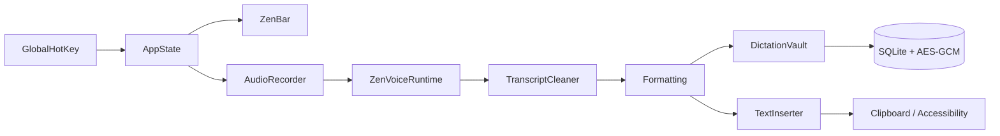

<p align="center">
  
</p>

<h1 align="center">ZenVoice</h1>

<p align="center">
  Private, local-first voice dictation for macOS.<br>
  Speak into whichever window has focus. The transcript is typed there.
</p>

<p align="center">
  
  
  
  
  
</p>

ZenVoice is a native macOS menu-bar app that records on this Mac, decodes with a local speech engine, and pastes into the frontmost app. There is no account, no subscription, no analytics, and no cloud transcription. The one network path that can leave this machine — optional BYO-key Cloud formatting — is off until you turn it on and put your own key in the Keychain.

| | |
|---|---|
| **Platform** | Native macOS 14+ · Apple Silicon |
| **Stack** | Swift · SwiftUI · AppKit · AVFoundation · Accessibility |
| **Data** | Local-first · AES-GCM transcripts · Keychain-held vault key |
| **Status** | Daily personal use · public shipping deferred ([ADR 0004](docs/decisions/0004-internal-use-first-defer-shipping.md)) |

## Why

Dictation that leaves the machine is fast and someone else's problem. Dictation that stays here is only useful if it is as close as a keystroke, honest about what it stored, and quiet enough to leave open all day.

ZenVoice is built for that second job: a capsule on the display you are working on, a settings window you open when something needs changing, and a privacy inventory that counts what is actually on disk.

## How it works

```text
Hotkey
  → local microphone (16 kHz mono)
  → app profile + optional in-memory context
  → selected local engine
  → conservative cleanup
  → Formatting (Off / Clean / Smart / Cloud)
  → personal correction rules
  → clipboard + Accessibility paste
```

Closing the settings window does not quit. The status item and the shortcut stay. **⌘W** closes the window; **⌘Q** quits.

## What it does

| Area | Behaviour |
|---|---|
| **Dictation** | `Control + Option + Space` by default. Hold-to-dictate, paste-last (`⌃⌥V`), and Private Dictation (`⌃⌥P`) are configurable. Live preview and commit-on-pause are optional. |
| **ZenBar** | At rest: a 108×36 capsule (mark + flat meter) on the display of the focused app. Controls appear on hover. An error is the one state that stays open. |
| **Engines** | Whisper (`whisper.cpp` v1.9.1), Apple Speech, Parakeet TDT v2/v3, Parakeet Flash, Nemotron 3.5, Cohere Transcribe (on-device ONNX). Flash and Nemotron Ultra Fast are live-preview only. |
| **Languages** | English-safe default, 64 selectable languages, Hinglish Latin / native-script / local English-translation. |
| **Formatting** | Off, deterministic Clean, guarded on-device Smart (macOS 26+), opt-in BYO-key Cloud. |
| **History** | Encrypted by default. Search, copy, retry, delete, Recovery Inbox. Pause independently of Private Dictation. |
| **Insights** | Words, weighted WPM, streaks, apps, categories — all derived locally. Highlight cards carry numbers only. |
| **Voice profile** | Recurring phrases and explicit correction rules, encrypted. Not a biometric voiceprint. |
| **Commands** | Local layout/punctuation phrases. Optional Agentic Mode: a spoken goal becomes a reviewable plan; nothing runs until you approve those exact steps. |
| **Audio** | Pin a mic or follow System Default. Three-second on-device Audio Doctor. Optional Audio History is off and unencrypted — see [Privacy](docs/PRIVACY.md). |

Do not re-add FluidAudio or Fluid Intelligence. NVIDIA engines run on open `parakeet.cpp`.

## Design

The visual system is the apple-design theme adopted on `main`: ink, one jade, real materials, springs. The contract lives in [`docs/DESIGN.md`](docs/DESIGN.md). Pixels live in `ZenDesignTokens`, `ZenChrome`, and `ZenV2Components`. All twenty-six screens compose from those three files.

**Ink, one jade, real materials.** The accent does three jobs: the selected navigation row, the primary action, and live state. Everything else is monochrome. Nine jade glyphs is the same as zero.

**Depth from light, not boxes.** A card is a surface with a shadow and a bright top edge. Hairlines are the fallback. Nested rows draw no border.

**Type carries the hierarchy.** 11pt floor, 34pt metric. Tracking tightens as size grows. `Scripts/check-ui-invariants.sh` fails type below the floor.

**Motion is a spring.** Critically damped by default; overshoot only when a gesture threw it. Controls scale on pointer-down. Reduce Motion returns `nil` from every helper.

```
┌─────────────┬──────────────────────────────────────┐
│             │  ZenVoice        ( status ⌘ ☾ ) Dictate│
│  ● Home     ├──────────────────────────────────────┤
│  Configure  │           Page title                 │
│    Dictation│           Page subtitle              │
│  Use        │   ┌────────────────────────────────┐ │
│  Activity   │   │ card                           │ │
│  Help       │   └────────────────────────────────┘ │
└─────────────┴──────────────────────────────────────┘
   vibrancy                     canvas
```

The rail is full-height vibrancy under the traffic lights. Selected navigation is `accentMuted` plus an accent icon, not a filled pill. New UI uses the tokens. Do not hand-roll a second green.

## Privacy

Application code does not send audio, transcripts, clipboard contents, or usage analytics over the network.

| What | Where it lives |
|---|---|
| Transcripts | AES-GCM in local SQLite; 256-bit key in the Keychain |
| Recovery audio | Private Application Support, ≤ 24 hours, failed dictations only |
| Audio History | Off. Unencrypted WAV archive if you turn it on. Never leaves the Mac unless you export it. |
| Next-dictation context | Memory only, 500 characters, cleared when recording starts |
| Cloud formatting | Off. Sends finished text + your prompt to *your* HTTPS endpoint, with *your* Keychain key. Never audio, never the target app. |
| Agentic steps | Off. Approved `codex` / `claude` / `zsh` steps are those tools' own network, not ZenVoice's. |

The Privacy screen counts encrypted transcripts, recovery audio, correction rules, and installed models in-process. Those counts are not telemetry.

Full boundary: [Privacy](docs/PRIVACY.md).

## Requirements

- macOS 14 or newer on Apple Silicon. Certified-for-release versions are recorded per candidate in [Release Readiness](docs/RELEASE_READINESS.md); macOS 14–26 have not been certified.
- Xcode, not only Command Line Tools — SwiftUI macros ship with Xcode.
- Internet on the first build, for the pinned `whisper.cpp` XCFramework.
- A verified model from the **Models** screen before the first real dictation.

## Build

```bash
git clone https://github.com/imYashChaudhary973/ZenVoice.git
cd ZenVoice
./Scripts/build-app.sh
open build/ZenVoice.app
```

On first use macOS asks for **Microphone** (capture) and **Accessibility** (paste). Without Accessibility, the transcript still lands on the clipboard.

There is no signed public release yet. A Homebrew cask and a GitHub Release zip are prepared and inert.

## Use

1. **Shortcuts** — keep `⌃⌥Space` or record your own.
2. **Models** — download a checksum-pinned English, multilingual, or Hinglish model.
3. **Languages** — English, Hinglish, auto-detect, or another spoken language.
4. Put the caret in any editable field.
5. Press the shortcut, speak, press it again.

Hold-to-dictate is in Shortcuts: hold the chosen modifier, speak, release.

## Architecture



| Target | Responsibility |
|---|---|
| `ZenVoice` | App, ZenBar, settings window, design system |
| `ZenVoiceCore` | Cleanup, formatting, hotkeys, catalogues, insertion policy |
| `ZenVoiceRuntime` | Local engines: Whisper, Apple Speech, Parakeet, Nemotron, Cohere |
| `ZenVoiceStorage` | Encrypted vault, insights, voice profile, audio archive |
| `ZenVoice*Checks` | Deterministic checks the compiler cannot see |

A loaded model is 600–940 MB of GPU buffers. After five idle minutes the registry unloads; the next dictation warms again. With nothing resident the app sits near 50 MB. Measure `phys_footprint`, not RSS.

## Verify

```bash
swift run ZenVoiceCoreChecks
swift run ZenVoiceStorageChecks
swift run ZenVoiceRuntimeChecks
swift build
./Scripts/check-ui-invariants.sh
./Scripts/build-app.sh
codesign --verify --deep --strict build/ZenVoice.app
```

Point a runtime check at a model with `ZENVOICE_MODEL_PATH`. `ZENVOICE_RUNTIME_REQUIRED=1` fails instead of skipping when none is visible. Real-speech decoding runs on the scheduled `speech-gate`, not on every PR.

## Documentation

Start at the [documentation index](docs/README.md). `docs/` describes the product as it is now. Finished plans are deleted, not archived. Decisions live in [`docs/decisions/`](docs/decisions/).

| Document | What it covers |
|---|---|
| [Design](docs/DESIGN.md) | Tokens, chrome, motion, the window shell |
| [Architecture](docs/ARCHITECTURE.md) | Layers, memory, the dictation path |
| [Privacy](docs/PRIVACY.md) | What never leaves, and the one path that can |
| [Model catalogue](docs/MODEL_CATALOG.md) | Pinned revisions and hashes |
| [Development](docs/DEVELOPMENT.md) | Toolchain, checks, manual QA |
| [Roadmap](docs/ROADMAP.md) | Direction, not a release promise |
| [Contributing](CONTRIBUTING.md) | Branch, commit, and PR rules |
| [Changelog](CHANGELOG.md) | What changed |

## Status

Working and in daily personal use. Apache-2.0. Public shipping is deferred until the product has matured through that use and a deliberate shipping decision is made. Passing CI is not a claim of public availability.
