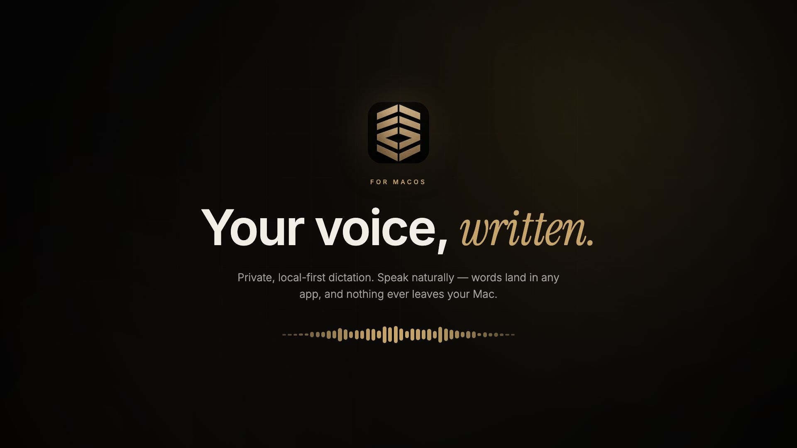
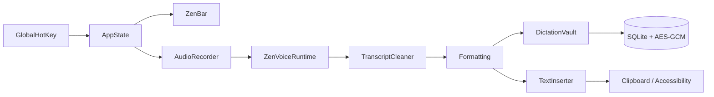

<p align="center">
  
</p>

<p align="center">
  
</p>

<p align="center">
  <a href="https://git.io/typing-svg">
    
  </a>
</p>

<p align="center">
  
  
  
  
  
</p>

<p align="center">
  
</p>

<p align="center">
  <a href="https://github.com/imYashChaudhary973/ZenVoice/releases/latest">
    
  </a>
</p>

<p align="center">
  
</p>

ZenVoice is a native macOS menu-bar app. Press a shortcut, speak, press it again. The transcript is typed into whichever app has focus.

Recording, decoding, cleanup, and paste all happen on this Mac. There is no account, no subscription, no analytics, and no cloud transcription. Optional BYO-key Cloud formatting is off until you turn it on.

Public GitHub beta. Apache-2.0.

---

## Features

- **Global shortcut** — `⌃⌥Space` by default. Hold-to-dictate, paste-last (`⌃⌥V`), and Private Dictation (`⌃⌥P`) are configurable.
- **ZenBar** — a 108×36 capsule on the display you are working on. Controls appear on hover. An error is the one state that stays open.
- **On-device engines** — Whisper, Apple Speech, Parakeet TDT v2/v3, Parakeet Flash, Nemotron 3.5, and Cohere Transcribe. Nothing is sent to a speech API.
- **Live preview** — optional on-device preview while you speak. Flash and Nemotron Ultra Fast are preview-only; final insert stays on TDT v3 or Whisper.
- **Formatting** — Off, deterministic Clean, guarded on-device Smart (macOS 26+), or opt-in BYO-key Cloud. Cloud never sends audio.
- **Encrypted history** — AES-GCM transcripts, search, copy, retry, delete, Recovery Inbox. Pause independently of Private Dictation.
- **Lecture Capture (v1)** — record long-form audio from the menu bar, transcribe it with your chosen on-device engine, and optionally summarize the text with your own API key. Audio stays on disk; only finished text is sent if you enable a cloud summary.
- **Insights** — words, weighted WPM, streaks, apps, categories. All derived locally. Share cards carry numbers only.
- **Voice profile** — recurring phrases and explicit correction rules, encrypted. Not a biometric voiceprint.
- **Audio Doctor** — three-second local mic check. Pin a microphone or follow System Default.
- **Per-app rules** — language, refinement, and local voice-command behaviour from the original target app.
- **Menu bar + main menu** — status item stays after you close the window. **⌘W** closes; **⌘Q** quits.

---

## Supported models

An **engine** is the runtime. A **model** is the file it loads. Whisper can pick among four files. Each NVIDIA engine is pinned to one checkpoint. Mixing families does not work.

| Engine / model | Best for | Languages | Download | Hardware |
|---|---|---|---|---|
| **Parakeet TDT v3** | Default English / European insert | [25 languages](#parakeet-tdt-v3) | ~897 MB | Apple Silicon |
| **Parakeet TDT v2** | English-only insert | English | ~862 MB | Apple Silicon |
| **Parakeet Flash** | Live English preview only | English | ~168 MB | Apple Silicon |
| **Nemotron 3.5 Ultra Fast** | Streaming preview only | ~40 locales | ~938 MB | Apple Silicon |
| **Nemotron 3.5 Multilingual** | Offline multilingual insert | ~40 locales | same file as Ultra Fast | Apple Silicon |
| **Whisper Turbo** | Auto-detect / 99-language fallback | [99 languages](#whisper) | ~547 MB | Apple Silicon |
| **Whisper Medium** | High-accuracy multilingual Whisper | 99 languages | ~1.4 GB | Apple Silicon |
| **Whisper Small** | Intel / low-memory compromise | 99 languages (European in practice) | ~465 MB | Apple Silicon + Intel |
| **Hinglish Apex** | Hindi–English Latin output | Hinglish | ~834 MB | Apple Silicon |
| **Cohere Transcribe** | Local high-accuracy multilingual | [14 languages](#cohere-transcribe) | ~3.1 GB | Apple Silicon |
| **Apple Speech** | Zero-download fallback | System languages | None | Apple Silicon + Intel |

Measured on the frozen Common Voice Spontaneous set (2026-08-18): **Parakeet TDT v3 is 6.9% WER at 73× real time**; Whisper Turbo is 8.2% at 11×. Full table: [REAL_SPEECH_CORPUS.md](docs/REAL_SPEECH_CORPUS.md).

### Parakeet TDT v3

Bulgarian, Croatian, Czech, Danish, Dutch, English, Estonian, Finnish, French, German, Greek, Hungarian, Italian, Latvian, Lithuanian, Maltese, Polish, Portuguese, Romanian, Russian, Slovak, Slovenian, Spanish, Swedish, Ukrainian.

### Parakeet TDT v2

English.

### Cohere Transcribe

English, French, German, Italian, Spanish, Portuguese, Greek, Dutch, Polish, Mandarin, Japanese, Korean, Vietnamese, Arabic.

### Apple Speech

Whatever on-device languages macOS Speech has installed. Audio never leaves the Mac (`requiresOnDeviceRecognition`).

### Whisper

Up to 99 languages, depending on the file. Turbo is the multilingual default. Small is the Intel fallback, not a speed tier. Tiny and Base are retired.

### What gets recommended

| Condition | Final engine |
|---|---|
| English or European locale on Apple Silicon | Parakeet TDT v3 |
| Auto-detect / non-European | Whisper Turbo |
| Hinglish | Apex only |
| No TDT v3 installed | Apple Speech |
| Intel | Whisper Small |

Pinned hashes and URLs: [Model catalogue](docs/MODEL_CATALOG.md).

NVIDIA engines run on open `parakeet.cpp`. Do not re-add FluidAudio or Fluid Intelligence.

---

## Quick start

1. **Download** `ZenVoice.dmg` from [Releases](https://github.com/imYashChaudhary973/ZenVoice/releases/latest). Open the DMG and drag `ZenVoice.app` to `/Applications`.
2. **Allow Microphone and Accessibility.** Without Accessibility, text still lands on the clipboard.
3. **Finish setup** — language, then the recommended engine/model, then a test dictation.
4. **Put the caret** in any editable field. Press `⌃⌥Space`, speak, press it again.
5. **(Optional)** Hold-to-dictate, Private Dictation, live preview, and Cloud formatting live in Shortcuts / Personalisation. All of them stay off until you turn them on.

---

## Requirements

- Apple Silicon Mac for NVIDIA engines and the recommended path
- Intel Macs: Whisper Small only
- Build target is macOS 14+. Certified on recent macOS; 14–26 are uncertified
- Disk: one engine file, typically 170 MB–1.4 GB (Cohere ~3.1 GB if you choose it)
- Microphone access
- Accessibility permission to type into other apps

---

## How it works

```text
Hotkey
  → local microphone (16 kHz mono)
  → app profile + optional in-memory context
  → selected local engine
  → conservative cleanup
  → Formatting (Off / Clean / Smart / Cloud)
  → personal correction rules
  → clipboard + Accessibility paste
```

Closing the settings window does not quit. **⌘W** closes the window; **⌘Q** quits.

---

## Privacy

Application code does not send audio, transcripts, clipboard contents, or usage analytics over the network.

| What | Where it lives |
|---|---|
| Transcripts | AES-GCM in local SQLite; 256-bit key in the Keychain |
| Recovery audio | Private Application Support, ≤ 24 hours, failed dictations only |
| Audio History | Off. Unencrypted WAV archive if you turn it on. Never leaves the Mac unless you export it. |
| Next-dictation context | Memory only, 500 characters, cleared when recording starts |
| Cloud formatting | Off. Sends finished text + your prompt to *your* HTTPS endpoint, with *your* Keychain key. Never audio, never the target app. |

The Privacy screen counts what is on disk. Those counts are not telemetry.

Full boundary: [Privacy](docs/PRIVACY.md).

---

## Build from source

Xcode required (SwiftUI macros). Internet on the first build, for the pinned `whisper.cpp` XCFramework.

```bash
git clone https://github.com/imYashChaudhary973/ZenVoice.git
cd ZenVoice
./Scripts/build-app.sh
open build/ZenVoice.app
```

---

## Verify

```bash
swift run ZenVoiceCoreChecks
swift run ZenVoiceStorageChecks
swift run ZenVoiceRuntimeChecks
swift build
./Scripts/check-ui-invariants.sh
./Scripts/build-app.sh
codesign --verify --deep --strict build/ZenVoice.app
```

Point a runtime check at a model with `ZENVOICE_MODEL_PATH`. `ZENVOICE_RUNTIME_REQUIRED=1` fails instead of skipping when none is visible.

---

## Architecture



| Target | Responsibility |
|---|---|
| `ZenVoice` | App, ZenBar, settings window, design system |
| `ZenVoiceCore` | Cleanup, formatting, hotkeys, catalogues, insertion policy |
| `ZenVoiceRuntime` | Local engines: Whisper, Apple Speech, Parakeet, Nemotron, Cohere |
| `ZenVoiceStorage` | Encrypted vault, insights, voice profile, audio archive |
| `ZenVoice*Checks` | Deterministic checks the compiler cannot see |

A loaded model is 600–940 MB of GPU buffers. After five idle minutes the registry unloads. With nothing resident the app sits near 50 MB. Measure `phys_footprint`, not RSS.

---

## Documentation

Start at the [documentation index](docs/README.md).

| Document | What it covers |
|---|---|
| [Design](docs/DESIGN.md) | Tokens, chrome, motion, the window shell |
| [Architecture](docs/ARCHITECTURE.md) | Layers, memory, the dictation path |
| [Privacy](docs/PRIVACY.md) | What never leaves, and the one path that can |
| [Model catalogue](docs/MODEL_CATALOG.md) | Pinned revisions and hashes |
| [Development](docs/DEVELOPMENT.md) | Toolchain, checks, manual QA |
| [Roadmap](docs/ROADMAP.md) | Direction, not a release promise |
| [Contributing](CONTRIBUTING.md) | Branch, commit, and PR rules |
| [Changelog](CHANGELOG.md) | What changed |

---

## Status

Public GitHub beta. Apache-2.0. Auto-updates and Homebrew are off. Passing CI is not a 1.0 claim.

[File a bug](https://github.com/imYashChaudhary973/ZenVoice/issues/new?template=bug_report.md) if something breaks. Do not paste private transcripts.

<p align="center">
  <em>Speak. It types. Nothing leaves your Mac.</em>
</p>

<p align="center">
  
</p>
