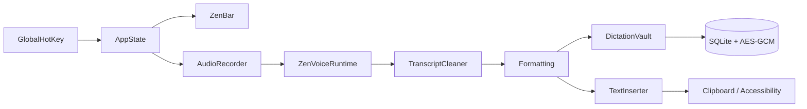

<p align="center">
  
</p>

<p align="center">
  
</p>

<p align="center">
  <a href="https://git.io/typing-svg">
    
  </a>
</p>

<p align="center">
  
  
  
  
  
</p>

<p align="center">
  <a href="https://github.com/imYashChaudhary973/ZenVoice/releases/latest">
    
  </a>
</p>

<p align="center">
  
</p>

---

## What it does

ZenVoice is a native macOS menu-bar app. Press a shortcut, speak, press it again. The transcript is typed into whichever app has focus.

Recording, decoding, cleanup, and paste all happen on this Mac. There is no account, no subscription, no analytics, and no cloud transcription. The one network path that can leave the machine — optional BYO-key Cloud formatting — is off until you turn it on and put your own key in the Keychain.

| | |
|---|---|
| **Platform** | Native macOS 14+ · Apple Silicon |
| **Stack** | Swift · SwiftUI · AppKit · AVFoundation · Accessibility |
| **Data** | Local-first · AES-GCM transcripts · Keychain-held vault key |
| **Status** | Public GitHub beta |

---

## How it works

```text
Hotkey
  → local microphone (16 kHz mono)
  → app profile + optional in-memory context
  → selected local engine
  → conservative cleanup
  → Formatting (Off / Clean / Smart / Cloud)
  → personal correction rules
  → clipboard + Accessibility paste
```

1. Put the caret in any editable field.
2. Press `Control + Option + Space` (or your shortcut).
3. Speak. ZenBar shows you it is listening.
4. Press the shortcut again. Text lands where you were typing.

Closing the settings window does not quit. The status item and the shortcut stay. **⌘W** closes the window; **⌘Q** quits.

---

## Features

| Area | Behaviour |
|---|---|
| **Dictation** | `⌃⌥Space` by default. Hold-to-dictate, paste-last (`⌃⌥V`), and Private Dictation (`⌃⌥P`) are configurable. Live preview and commit-on-pause are optional. |
| **ZenBar** | At rest: a 108×36 capsule on the display of the focused app. Controls appear on hover. An error is the one state that stays open. |
| **Engines** | Whisper (`whisper.cpp` v1.9.1), Apple Speech, Parakeet TDT v2/v3, Parakeet Flash, Nemotron 3.5, Cohere Transcribe (on-device ONNX). Flash and Nemotron Ultra Fast are live-preview only. |
| **Models** | The Models screen lists the checkpoint each engine loads. Only Whisper can pick among four files. A mismatched Use stays put. |
| **Languages** | English-safe default, 64 selectable languages, Hinglish Latin / native-script / local English-translation. |
| **Formatting** | Off, deterministic Clean, guarded on-device Smart (macOS 26+), opt-in BYO-key Cloud. |
| **History** | Encrypted by default. Search, copy, retry, delete, Recovery Inbox. |
| **Insights** | Words, weighted WPM, streaks, apps, categories — all derived locally. |
| **Voice profile** | Recurring phrases and explicit correction rules, encrypted. Not a biometric voiceprint. |
| **Audio** | Pin a mic or follow System Default. Three-second on-device Audio Doctor. |

Do not re-add FluidAudio or Fluid Intelligence. NVIDIA engines run on open `parakeet.cpp`.

---

## Privacy

Application code does not send audio, transcripts, clipboard contents, or usage analytics over the network.

| What | Where it lives |
|---|---|
| Transcripts | AES-GCM in local SQLite; 256-bit key in the Keychain |
| Recovery audio | Private Application Support, ≤ 24 hours, failed dictations only |
| Audio History | Off. Unencrypted WAV archive if you turn it on. Never leaves the Mac unless you export it. |
| Next-dictation context | Memory only, 500 characters, cleared when recording starts |
| Cloud formatting | Off. Sends finished text + your prompt to *your* HTTPS endpoint, with *your* Keychain key. Never audio, never the target app. |

The Privacy screen counts encrypted transcripts, recovery audio, correction rules, and installed models in-process. Those counts are not telemetry.

Full boundary: [Privacy](docs/PRIVACY.md).

---

## Requirements

- Apple Silicon Mac. Tested on recent macOS. The build targets macOS 14+, but 14–26 are uncertified.
- A model from the **Models** screen before the first real dictation.

---

## Install

1. Download `ZenVoice-distribution.zip` from [Releases](https://github.com/imYashChaudhary973/ZenVoice/releases/latest).
2. Unzip and drag `ZenVoice.app` to `/Applications`.
3. Open it. Allow **Microphone** and **Accessibility**.
4. Finish setup: language, recommended model, try a dictation.

Without Accessibility, the transcript still lands on the clipboard.

[File a bug](https://github.com/imYashChaudhary973/ZenVoice/issues/new?template=bug_report.md) if something breaks. Do not paste private transcripts.

---

## Build from source

Xcode required (SwiftUI macros). Internet on the first build, for the pinned `whisper.cpp` XCFramework.

```bash
git clone https://github.com/imYashChaudhary973/ZenVoice.git
cd ZenVoice
./Scripts/build-app.sh
open build/ZenVoice.app
```

---

## Use

1. **Shortcuts** — keep `⌃⌥Space` or record your own.
2. **Models** — pick the engine, then the file it can load. Whisper has four; each NVIDIA engine has one.
3. **Languages** — English, Hinglish, auto-detect, or another spoken language.
4. Put the caret in any editable field.
5. Press the shortcut, speak, press it again.

Hold-to-dictate is in Shortcuts: hold the chosen modifier, speak, release.

---

## Architecture



| Target | Responsibility |
|---|---|
| `ZenVoice` | App, ZenBar, settings window, design system |
| `ZenVoiceCore` | Cleanup, formatting, hotkeys, catalogues, insertion policy |
| `ZenVoiceRuntime` | Local engines: Whisper, Apple Speech, Parakeet, Nemotron, Cohere |
| `ZenVoiceStorage` | Encrypted vault, insights, voice profile, audio archive |
| `ZenVoice*Checks` | Deterministic checks the compiler cannot see |

A loaded model is 600–940 MB of GPU buffers. After five idle minutes the registry unloads; the next dictation warms again. With nothing resident the app sits near 50 MB. Measure `phys_footprint`, not RSS.

---

## Verify

```bash
swift run ZenVoiceCoreChecks
swift run ZenVoiceStorageChecks
swift run ZenVoiceRuntimeChecks
swift build
./Scripts/check-ui-invariants.sh
./Scripts/build-app.sh
codesign --verify --deep --strict build/ZenVoice.app
```

Point a runtime check at a model with `ZENVOICE_MODEL_PATH`. `ZENVOICE_RUNTIME_REQUIRED=1` fails instead of skipping when none is visible.

---

## Documentation

Start at the [documentation index](docs/README.md). `docs/` describes the product as it is now.

| Document | What it covers |
|---|---|
| [Design](docs/DESIGN.md) | Tokens, chrome, motion, the window shell |
| [Architecture](docs/ARCHITECTURE.md) | Layers, memory, the dictation path |
| [Privacy](docs/PRIVACY.md) | What never leaves, and the one path that can |
| [Model catalogue](docs/MODEL_CATALOG.md) | Pinned revisions and hashes |
| [Development](docs/DEVELOPMENT.md) | Toolchain, checks, manual QA |
| [Roadmap](docs/ROADMAP.md) | Direction, not a release promise |
| [Contributing](CONTRIBUTING.md) | Branch, commit, and PR rules |
| [Changelog](CHANGELOG.md) | What changed |

---

## Status

Public GitHub beta. Apache-2.0. Auto-updates and Homebrew are off. Passing CI is not a 1.0 claim.

<p align="center">
  <em>Speak. It types. Nothing leaves your Mac.</em>
</p>

<p align="center">
  
</p>
