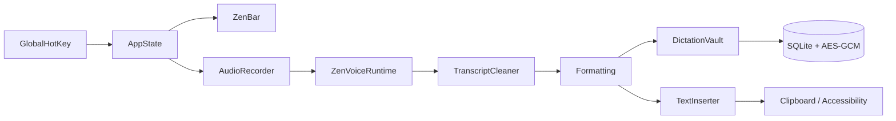

<p align="center">
  
</p>

<p align="center">
  
</p>

<p align="center">
  <a href="https://git.io/typing-svg">
    
  </a>
</p>

<p align="center">
  
  
  
  
  
</p>

<p align="center">
  
</p>

<p align="center">
  <a href="https://github.com/imYashChaudhary973/ZenVoice/releases/latest">
    
  </a>
</p>

<p align="center">
  
</p>

ZenVoice is a native macOS menu-bar app. Press a shortcut, speak, press it again. The transcript is typed into whichever app has focus.

Local engines record, decode, clean, and paste on this Mac. There is no account, no subscription, no analytics, and no cloud speech.

Public GitHub beta, 0.4.5. Apache-2.0.

---

## Features

- **Global shortcut** — `⌃⌥Space` by default. Hold-to-dictate and paste-last (`⌃⌥V`) are configurable.
- **ZenBar** — a 108×36 capsule on the display you are working on. Controls appear on hover. A live audio meter runs while you dictate. An error is the one state that stays open.
- **On-device engines** — Whisper, Parakeet TDT, Apple Speech, and other local runtimes. Audio never leaves this Mac.
- **Formatting** — Off, deterministic Clean, or guarded on-device Smart (macOS 26+).
- **Encrypted history** — AES-GCM transcripts, search, copy, retry, delete, Recovery Inbox.
- **Insights** — WPM gauge, total words, fixes, app usage, and a GitHub-style contribution calendar. All derived locally. Share cards carry numbers only.
- **Voice commands** — on-device phrase matching. Off until you turn it on.
- **Voice profile** — recurring phrases and explicit correction rules, encrypted. Not a biometric voiceprint.
- **Audio Doctor** — three-second local mic check. Pin a microphone or follow System Default.
- **Menu bar + main menu** — status item stays after you close the window. **⌘W** closes; **⌘Q** quits.

---

## Supported models

Choose an engine. Use downloads its file.

| Engine | Best for | Languages | Download | Hardware |
|---|---|---|---|---|
| **Parakeet TDT v3** | Default English / European insert | [25 languages](#parakeet-tdt-v3) | ~897 MB | Apple Silicon |
| **Whisper Large V3 Turbo** | Auto-detect / 99-language fallback | [99 languages](#whisper) | ~547 MB | Apple Silicon |
| **Whisper Large V3** | Higher-accuracy multilingual Whisper | 99 languages | ~1.0 GB | Apple Silicon |
| **Distil-Whisper Large V3** | Faster English | English | ~1.4 GB | Apple Silicon + Intel |

Measured on the frozen Common Voice Spontaneous set (2026-08-18): **Parakeet TDT v3 is 6.9% WER at 73× real time**; Whisper Turbo is 8.2% at 11×. Full table: [REAL_SPEECH_CORPUS.md](docs/REAL_SPEECH_CORPUS.md).

### Parakeet TDT v3

Bulgarian, Croatian, Czech, Danish, Dutch, English, Estonian, Finnish, French, German, Greek, Hungarian, Italian, Latvian, Lithuanian, Maltese, Polish, Portuguese, Romanian, Russian, Slovak, Slovenian, Spanish, Swedish, Ukrainian.

### Whisper

Turbo and Large V3 cover up to 99 languages. Distil-Whisper Large V3 is English-only. Tiny, Base, Small, Medium, and Hinglish Apex are retired.

### What gets recommended

| Condition | Final engine |
|---|---|
| English or European locale on Apple Silicon (12 GB+) | Parakeet TDT v3 |
| Apple Silicon under 12 GB | Distil-Whisper Large V3 |
| Auto-detect / non-European | Whisper Large V3 Turbo |
| Hinglish | Whisper Large V3 Turbo (Apex retired) |
| No TDT v3 installed | Whisper Large V3 Turbo |
| Intel English | Distil-Whisper Large V3 |

Pinned hashes and URLs: [Model catalogue](docs/MODEL_CATALOG.md).

NVIDIA engines run on open `parakeet.cpp`. Do not re-add FluidAudio or Fluid Intelligence.

---

## Quick start

1. **Download** `ZenVoice.dmg` from [Releases](https://github.com/imYashChaudhary973/ZenVoice/releases/latest). Open the DMG and drag `ZenVoice.app` to `/Applications`.
2. **Allow Microphone and Accessibility.** Without Accessibility, text still lands on the clipboard.
3. **Finish setup** — language, then the recommended engine/model, then a test dictation.
4. **Put the caret** in any editable field. Press `⌃⌥Space`, speak, press it again.
5. **(Optional)** Hold-to-dictate lives in Shortcuts.

---

## Requirements

- Apple Silicon Mac for NVIDIA engines and the recommended path
- Intel Macs: Distil-Whisper Large V3 (English) or Whisper Large V3 Turbo
- Build target is macOS 15+. Certified on recent macOS; 15–26 are uncertified
- Disk: one engine file, typically 547 MB–1.4 GB
- Microphone access
- Accessibility permission to type into other apps

---

## How it works

```text
Hotkey
  → local microphone (16 kHz mono)
  → selected local engine
  → conservative cleanup
  → Formatting (Off / Clean / Smart)
  → personal correction rules
  → clipboard + Accessibility paste
```

Closing the settings window does not quit. **⌘W** closes the window; **⌘Q** quits.

---

## Privacy

Application code does not send audio, transcripts, clipboard contents, or usage analytics over the network.

| What | Where it lives |
|---|---|
| Transcripts | AES-GCM in local SQLite; 256-bit key in the Keychain |
| Recovery audio | Private Application Support, ≤ 24 hours, failed dictations only |
| Audio History | Off. Unencrypted WAV archive if you turn it on. Never leaves the Mac unless you export it. |
| Cloud speech | Removed. Audio never leaves this Mac. |
| Cloud formatting | Removed. Use Off, Clean, or on-device Smart. |

The Privacy screen counts what is on disk. Those counts are not telemetry.

Full boundary: [Privacy](docs/PRIVACY.md).

---

## Build from source

Xcode required (SwiftUI macros). Internet on the first build, for the pinned `whisper.cpp` XCFramework.

```bash
git clone https://github.com/imYashChaudhary973/ZenVoice.git
cd ZenVoice
./Scripts/build-app.sh
open build/ZenVoice.app
```

---

## Verify

```bash
swift run ZenVoiceCoreChecks
swift run ZenVoiceStorageChecks
swift run ZenVoiceRuntimeChecks
swift build
./Scripts/check-ui-invariants.sh
./Scripts/build-app.sh
codesign --verify --deep --strict build/ZenVoice.app
```

Point a runtime check at a model with `ZENVOICE_MODEL_PATH`. `ZENVOICE_RUNTIME_REQUIRED=1` fails instead of skipping when none is visible.

---

## Architecture



| Target | Responsibility |
|---|---|
| `ZenVoice` | App, ZenBar, settings window, design system |
| `ZenVoiceCore` | Cleanup, formatting, hotkeys, catalogues, insertion policy |
| `ZenVoiceRuntime` | Local engines (Whisper, Parakeet, Apple Speech, Cohere, Qwen3-ASR) |
| `ZenVoiceStorage` | Encrypted vault, insights, voice profile, audio archive |
| `ZenVoice*Checks` | Deterministic checks the compiler cannot see |

A loaded model is 600–940 MB of GPU buffers. After five idle minutes the registry unloads. With nothing resident the app sits near 50 MB. Measure `phys_footprint`, not RSS.

---

## Documentation

Start at the [documentation index](docs/README.md).

| Document | What it covers |
|---|---|
| [Design](docs/DESIGN.md) | Tokens, chrome, motion, the window shell |
| [Architecture](docs/ARCHITECTURE.md) | Layers, memory, the dictation path |
| [Privacy](docs/PRIVACY.md) | What stays local |
| [Model catalogue](docs/MODEL_CATALOG.md) | Pinned revisions and hashes |
| [Development](docs/DEVELOPMENT.md) | Toolchain, checks, manual QA |
| [Roadmap](docs/ROADMAP.md) | Direction, not a release promise |
| [Contributing](CONTRIBUTING.md) | Branch, commit, and PR rules |
| [Changelog](CHANGELOG.md) | What changed |

---

## Status

Public GitHub beta. Apache-2.0. Auto-updates and Homebrew are off. Passing CI is not a 1.0 claim.

[File a bug](https://github.com/imYashChaudhary973/ZenVoice/issues/new?template=bug_report.md) if something breaks. Do not paste private transcripts.

<p align="center">
  <em>Speak. It types. Local by default.</em>
</p>

<p align="center">
  
</p>
